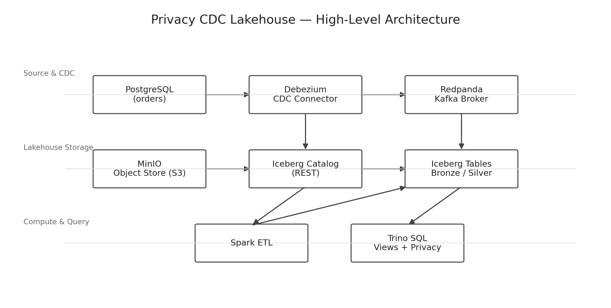

# Privacy CDC Lakehouse (Local) — Postgres → Debezium → Redpanda → Iceberg → Trino/Spark

A local, end-to-end Change Data Capture (CDC) lakehouse built on Docker Compose (Windows + PowerShell friendly).  
It captures inserts/updates/deletes from PostgreSQL via Debezium, streams them through Redpanda (Kafka API), lands raw events in Apache Iceberg (on MinIO), and exposes analytics through Trino and Spark.



---

## 1) Skills showcased (recruiter keywords)

- **Data Engineering**: CDC, incremental ingestion, bronze/silver layering, lakehouse patterns  
- **Streaming**: Kafka-compatible messaging (Redpanda), Kafka Connect, connector lifecycle  
- **Databases**: PostgreSQL logical replication, publications/replication slots, permissions  
- **Lakehouse**: Apache Iceberg tables, catalog concepts (REST), S3-backed storage (MinIO)  
- **Query Engines**: Trino SQL over Iceberg, schemas/namespaces, view-based privacy layer  
- **Compute/ETL**: Spark jobs writing to Iceberg, schema parsing, idempotent table writes  
- **DevOps**: Docker Compose, container debugging, logs, health checks, reproducible local stack  
- **Troubleshooting**: image/tag issues, YAML validation, auth/permission errors, data type pitfalls  
- **Automation**: PowerShell command-first workflows for running, verifying, and debugging

---

## 2) Architecture

**Flow**
1. Postgres emits WAL changes (logical replication)
2. Debezium captures changes and publishes CDC events
3. Redpanda brokers events (Kafka API)
4. Spark persists raw CDC to **Iceberg Bronze**
5. Spark builds **Iceberg Silver** current-state table
6. Trino queries Iceberg; privacy view masks user identifiers

**Diagram**
- See `docs/architecture.png` (committed to repo)

---

## 3) Services & ports (host machine)

- Trino: `http://localhost:8081` (container service: `trino:8080`)
- Kafka Connect (Debezium): `http://localhost:8083`
- Redpanda Console: `http://localhost:8080`
- MinIO API: `http://localhost:9000`
- MinIO Console: `http://localhost:9001`
- Postgres: `localhost:5432`

---

## 4) Quick start (PowerShell)

### 4.1 Boot the stack
```powershell
cd C:\Users\devra\privacy-cdc-lakehouse
docker compose up -d
docker compose ps
```

### 4.2 Verify connector is running
```powershell
Invoke-RestMethod "http://localhost:8083/connectors/pg-cdc/status"
```

### 4.3 Run Trino queries non-interactively (avoid pager / interactive aborts)
> Inside the Trino container, the Trino server is `http://localhost:8080`.

```powershell
docker exec -i trino trino --server http://localhost:8080 --pager=false --output-format TSV --execute "SHOW TABLES FROM iceberg.bronze"
```

---

## 5) Demo run (end-to-end)

### 5.1 Insert + update records in Postgres
```powershell
docker exec -it postgres psql -U app -d app -c "INSERT INTO public.orders(user_id, amount_eur, status) VALUES (101, 19.99, 'created'), (102, 49.50, 'created');"
docker exec -it postgres psql -U app -d app -c "UPDATE public.orders SET status='paid' WHERE user_id=101;"
```

### 5.2 Confirm bronze has CDC events
```powershell
docker exec -i trino trino --server http://localhost:8080 --pager=false --output-format TSV --execute "SELECT count(*) FROM iceberg.bronze.orders_cdc_raw"
```

### 5.3 Build/refresh silver (current state)
```powershell
docker exec -it spark spark-submit /jobs/build_orders_silver.py
```

### 5.4 Query silver
```powershell
docker exec -i trino trino --server http://localhost:8080 --pager=false --output-format TSV --execute "SELECT * FROM iceberg.silver.orders_current ORDER BY order_id"
```

---

## 6) Privacy layer (Trino view)

### 6.1 Why the `to_utf8()` fix matters
Trino’s `sha256()` expects **VARBINARY**, not VARCHAR.  
So the correct pattern is: `sha256(to_utf8(<string>))`.

### 6.2 Create privacy view
```powershell
docker exec -i trino trino --server http://localhost:8080 --pager=false --output-format TSV --execute "DROP VIEW IF EXISTS iceberg.silver.orders_current_priv"
docker exec -i trino trino --server http://localhost:8080 --pager=false --output-format TSV --execute @"
CREATE VIEW iceberg.silver.orders_current_priv AS
SELECT
  order_id,
  to_hex(sha256(to_utf8(cast(user_id as varchar) || '::SALT123'))) AS user_key,
  amount_eur,
  status,
  last_change_ts
FROM iceberg.silver.orders_current
"@
```

### 6.3 Query privacy view
```powershell
docker exec -i trino trino --server http://localhost:8080 --pager=false --output-format TSV --execute "SELECT * FROM iceberg.silver.orders_current_priv ORDER BY order_id"
```

**Honest note:** this is **pseudonymization**, not full anonymization. Hardcoding salt is demo-only.  
Roadmap includes moving the salt to env/secret management and materializing privacy tables via ETL.

---

## 7) What broke (real issues) and how we fixed it

This section is here because real data engineering is mostly: build + verify + debug.

### 7.1 Debezium image tag issue
**Symptom**: `manifest for debezium/connect:latest not found`  
**Fix**: pinned a known-good image tag (example): `quay.io/debezium/connect:3.1.3.Final`

### 7.2 docker-compose YAML error
**Symptom**: `mapping key "image" already defined`  
**Fix**: removed duplicate YAML keys and recreated the affected service.

### 7.3 Trino container not running / CLI fails
**Symptom**: `container ... is not running`  
**Fix**: `docker compose ps` + `docker logs -n 120 trino`, fix config issues, then `--force-recreate`.

### 7.4 Debezium publication/permission failures
**Symptoms**:
- `permission denied for database app`
- `must be owner of table orders`

**Fixes**:
- granted required privileges to `debezium`
- disabled auto-publication if ownership blocked it: `publication.autocreate.mode=disabled`
- recreated/restarted the connector and verified status.

### 7.5 Kafka Connect restart HTTP 415 (PowerShell)
**Symptom**: `HTTP 415 Unsupported Media Type`  
**Fix**: send JSON content-type and body: `-ContentType "application/json" -Body "{}"`

### 7.6 Spark → Iceberg REST “UnknownHost rest”
**Symptom**: `UnknownHostException: rest`  
**Fix**: Spark config referenced `http://rest:8181` but service name is `iceberg-rest` → corrected to `http://iceberg-rest:8181`.

### 7.7 Spark writer error
**Symptom**: `DataFrameWriterV2.overwrite() missing ... condition`  
**Fix**: replaced with Iceberg-friendly `createOrReplace()` pattern (full rebuild). Roadmap adds MERGE-based incremental.

### 7.8 DECIMAL handling (amount_eur missing)
**Root cause**: Debezium encodes DECIMAL as Kafka Connect `Decimal` bytes (base64) when using JSON-with-schema.  
**Fix options**:
- set Debezium `decimal.handling.mode=double` (simplifies downstream)
- or decode base64 bytes in Spark for backfills

---

## 8) Troubleshooting cheat sheet (copy/paste)

### 8.1 Overall status
```powershell
docker compose ps
docker compose logs --tail 80 trino
docker compose logs --tail 120 connect
docker compose logs --tail 120 spark
```

### 8.2 Connector status + config
```powershell
Invoke-RestMethod "http://localhost:8083/connectors"
Invoke-RestMethod "http://localhost:8083/connectors/pg-cdc/status"
Invoke-RestMethod "http://localhost:8083/connectors/pg-cdc/config"
```

### 8.3 Restart connector / task (PowerShell)
```powershell
Invoke-RestMethod -Method Post -Uri "http://localhost:8083/connectors/pg-cdc/restart" -ContentType "application/json" -Body "{}"
Invoke-RestMethod -Method Post -Uri "http://localhost:8083/connectors/pg-cdc/tasks/0/restart"
```

### 8.4 Trino: list schemas/tables and count bronze rows
```powershell
docker exec -i trino trino --server http://localhost:8080 --pager=false --output-format TSV --execute "SHOW SCHEMAS FROM iceberg"
docker exec -i trino trino --server http://localhost:8080 --pager=false --output-format TSV --execute "SHOW TABLES FROM iceberg.bronze"
docker exec -i trino trino --server http://localhost:8080 --pager=false --output-format TSV --execute "SELECT count(*) FROM iceberg.bronze.orders_cdc_raw"
```

### 8.5 Peek raw CDC payload (useful for schema/type issues)
```powershell
docker exec -i trino trino --server http://localhost:8080 --pager=false --output-format TSV --execute "SELECT substr(v, 1, 500) FROM iceberg.bronze.orders_cdc_raw ORDER BY ingested_at DESC LIMIT 1"
```

### 8.6 Run Spark jobs
```powershell
docker exec -it spark spark-submit /jobs/ingest_orders_raw.py
docker exec -it spark spark-submit /jobs/build_orders_silver.py
```

### 8.7 Pager trap (if you ever run interactive Trino CLI)
- press `q` to quit pager  
- or always use `--pager=false`

---

## 9) Roadmap (next upgrades)

1. **Incremental Silver** via `MERGE INTO` (avoid full rebuild).
2. **Checkpoint table** to persist offsets and enable exactly-once-ish rebuild logic.
3. **Privacy salt via env/secret** + materialized privacy table in Spark (no hardcoded salt).
4. **Data quality checks** (null checks, negative amounts, duplicates) with a metrics table.
5. **CI** smoke test: stack boots + key queries pass.

---

## 10) One-liner proof it works

```powershell
docker exec -i trino trino --server http://localhost:8080 --pager=false --output-format TSV --execute "SELECT count(*) FROM iceberg.bronze.orders_cdc_raw"
docker exec -i trino trino --server http://localhost:8080 --pager=false --output-format TSV --execute "SELECT * FROM iceberg.silver.orders_current ORDER BY order_id"
docker exec -i trino trino --server http://localhost:8080 --pager=false --output-format TSV --execute "SELECT * FROM iceberg.silver.orders_current_priv ORDER BY order_id"
```
